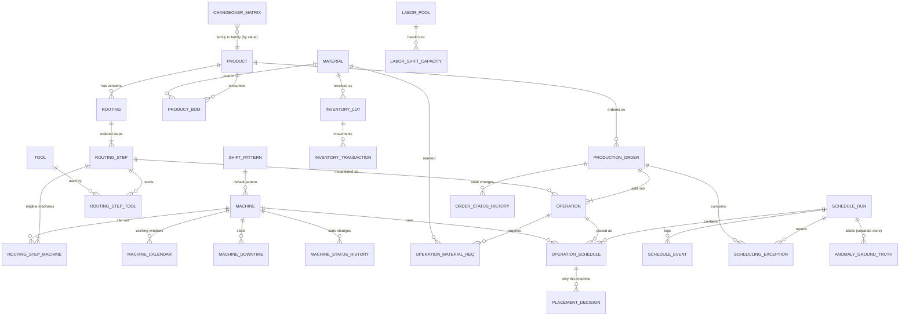

# Entity Relationship Diagram

Renders on GitHub. In VS Code, install the extension "Markdown Preview Mermaid Support".

```mermaid
erDiagram
    PRODUCT ||--o{ ROUTING : "has versions"
    ROUTING ||--|{ ROUTING_STEP : "ordered steps"
    ROUTING_STEP ||--|{ ROUTING_STEP_MACHINE : "eligible machines"
    MACHINE ||--o{ ROUTING_STEP_MACHINE : "can run"
    ROUTING_STEP ||--o{ ROUTING_STEP_TOOL : "needs"
    TOOL ||--o{ ROUTING_STEP_TOOL : "used by"
    SHIFT_PATTERN ||--o{ MACHINE : "default pattern"
    MACHINE ||--o{ MACHINE_CALENDAR : "working windows"
    MACHINE ||--o{ MACHINE_DOWNTIME : "stops"
    MACHINE ||--o{ MACHINE_STATUS_HISTORY : "state changes"
    PRODUCT ||--o{ PRODUCT_BOM : "consumes"
    MATERIAL ||--o{ PRODUCT_BOM : "used in"
    MATERIAL ||--o{ INVENTORY_LOT : "received as"
    INVENTORY_LOT ||--o{ INVENTORY_TRANSACTION : "movements"
    PRODUCT ||--o{ PRODUCTION_ORDER : "ordered as"
    PRODUCTION_ORDER ||--|{ OPERATION : "split into"
    ROUTING_STEP ||--o{ OPERATION : "instantiated as"
    OPERATION ||--o{ OPERATION_MATERIAL_REQ : "requires"
    MATERIAL ||--o{ OPERATION_MATERIAL_REQ : "needed"
    SCHEDULE_RUN ||--o{ OPERATION_SCHEDULE : "contains"
    OPERATION ||--o{ OPERATION_SCHEDULE : "placed as"
    MACHINE ||--o{ OPERATION_SCHEDULE : "runs"
    OPERATION_SCHEDULE ||--o{ PLACEMENT_DECISION : "why this machine"
    SCHEDULE_RUN ||--o{ SCHEDULE_EVENT : "logs"
    SCHEDULE_RUN ||--o{ SCHEDULING_EXCEPTION : "reports"
    PRODUCTION_ORDER ||--o{ SCHEDULING_EXCEPTION : "concerns"
    PRODUCTION_ORDER ||--o{ ORDER_STATUS_HISTORY : "state changes"
    CHANGEOVER_MATRIX }o--|| PRODUCT : "family to family (by value)"
    LABOR_POOL ||--o{ LABOR_SHIFT_CAPACITY : "headcount"
    SCHEDULE_RUN ||--o{ ANOMALY_GROUND_TRUTH : "labels (separate store)"
```